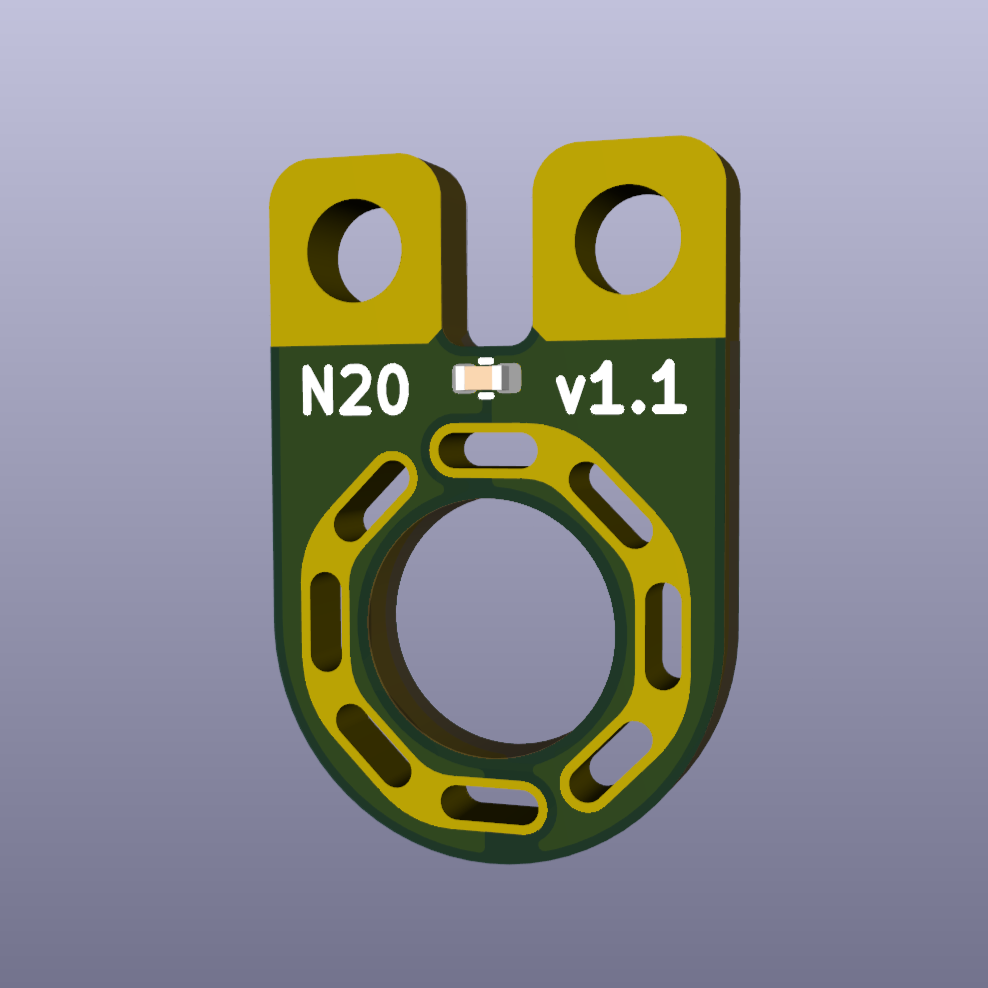

# N20 MOTOR TERMINAL BREAKOUTS v1.0 (2-pack)

Motor terminals are traditionally small and flimsy, making it hard to guarantee a reliable solder connection.
MOTOR TERMINAL BREAKOUTS are designed to simplify and strengthen these solder joints, enabling more reliable operation especally in high vibration environments: orignially designed for combat robotics but is suitable for any application using these motors. 
  
Developed, assembled, and tested in [Christchurch, New Zealand](https://www.google.co.nz/maps/place/Christchurch+New+Zealand), by Connor Benton.

## FEATURES
- Fits all N-series (N10 / N20 / N30) motors.
- Mounts to the motor at 0°, 45°, 90°, and 135° angles.
- Large pads with holes to enable stronger connections to the wires.
- Pads are broken out onto PCB fingers allowing the wires to be heatshrunk post soldering (providing even greater mechanical strength).
- 100nF capacitor across the motor output to filter noise and voltage spikes.

## SPECIFICATIONS
- **Dimensions:** 10x15x1 mm
- **Weight:** 1g each
- **Material:** Fiberglass (FR4)
- **Mounting Pad Center:** 7.5mm
- **Included in Package:** 2x N20 Motor Terminal Breakouts

## PACKAGE INCLUDES

- 2x N20 MOTOR TERMINAL BREAKOUTS